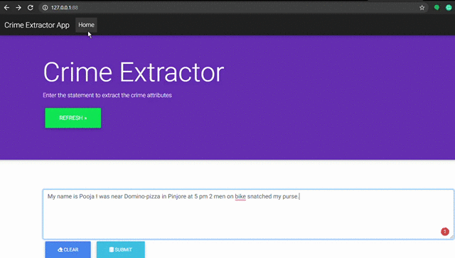

# Custom-NER (Crime Attribute Extraction)
This is project is an application of Named Entity Recognition using Spacy's Gold-Parser. 

## Model file
To get the already trained Crime Model click here [model](https://drive.google.com/file/d/1wRful1wioPHaK0o3YOtNMy2PWXQtdKX3/view?usp=sharing) <br>
This model has been trained on this - [dataset](https://github.com/shreyasharma98/Custom-NER/tree/master/data)

## Requirements
```
flask
spacy
pickle
```
## Demo


